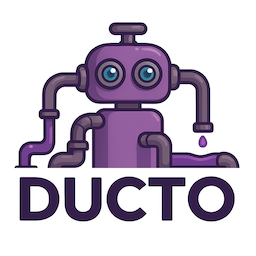

<!--suppress HtmlDeprecatedAttribute -->

    

# Ducto Faker

> Go library and CLI for generating fake/test event data based on templates/sample data using simple mustache syntax and inline modifiers; supports custom types.

---
## ✅ Features

- [ ] TODO!

You can also check the [specifications here](docs/specs.md).

---
## 🧑‍💻 Contributing

Please see our [Contributing Guide](./CONTRIBUTING.md).

---
## 🤖 Related Projects

- [ducto-dsl](https://github.com/tommed/ducto-dsl) - The DSL engine powering Ducto-Orchestrator
- [ducto-featureflags](https://github.com/tommed/ducto-featureflags) - A lightweight, embeddable, and pluggable feature flag engine
- [ducto-orchestrator](https://github.com/tommed/ducto-orchestrator) - A pluggable streaming runtime

---
## 📜 License

- Code is all licensed under [MIT](./LICENSE)
- The Ducto name, logos and robot illustrations (and likeness) are (C) Copyright 2025 Tom Medhurst, all rights reserved.
